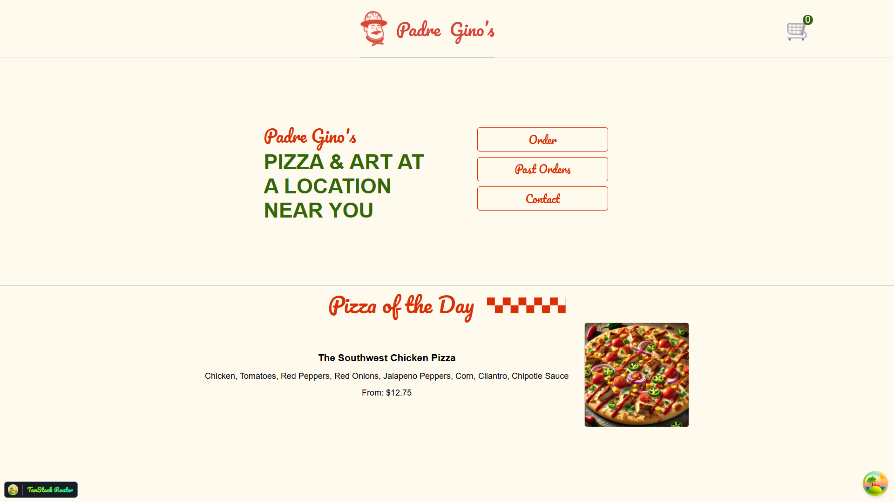
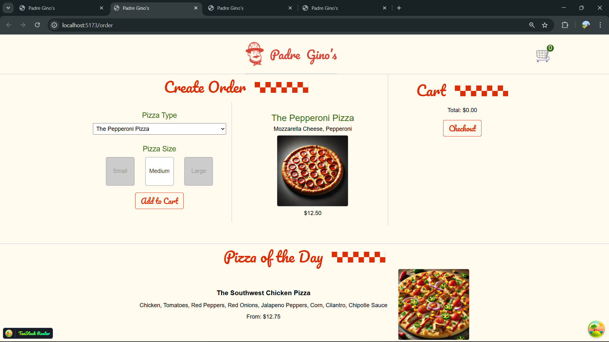
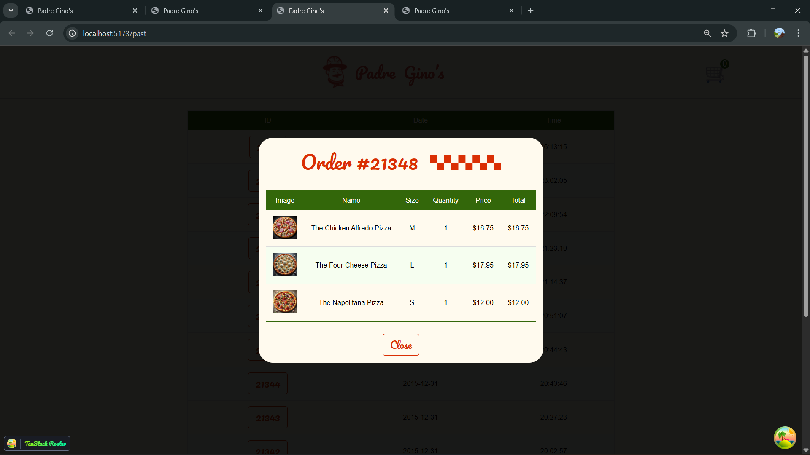

# 🍕 Recall React — Padre Gino's Pizza

A progressive React learning project built alongside Brian Holt's [Complete Intro to React v9](https://react-v9.holt.courses). Each commit represents a learning checkpoint with incrementally more advanced concepts.

> **Not just another tutorial follow-along** — this README includes key insights and patterns behind each concept.

## Tech Stack

| Tool | Purpose |
|---|---|
| React 18/19 | UI library (with React 19 features) |
| Vite | Build tool & dev server |
| TanStack Router | File-based routing |
| TanStack React Query | Server state management |
| Vitest + happy-dom | Testing framework |
| ESLint + Prettier | Code quality |

## Getting Started

```bash
cd padre-gino
npm install
npm run dev
```

---

## App Preview

| Home Page | Order Page | Past Orders (Modal + Portal) |
|---|---|---|
|  |  |  |
| Pizza of the Day via custom hook + `useEffect` | Controlled form with `useState` + cart via Context | Portal modal + Error Boundary + `use()` + Suspense |

---

## 📚 Learning Progression

### Part 1 — Foundations
> JSX, components, props

- **JSX is not HTML** — it's `React.createElement()` calls in disguise. The project starts with raw `React.createElement()` then migrates to JSX, showing they produce identical output.
- **Props are read-only** — data flows one way (parent → child). This is React's core mental model and a key architectural decision that makes apps predictable.

### Part 2 — Hooks
> `useState`, `useEffect`, `useContext`

- **`useState` triggers re-renders** — calling the setter function causes React to re-run the component function. Understanding this is essential for debugging "why did my component render?"
- **`useEffect` is for synchronization, not lifecycle** — think of it as "keep this side effect in sync with these dependencies", not "run this on mount."
- **`useContext` solves prop drilling** — but it re-renders *every* consumer when the value changes. For global state at scale, consider external state managers.

### Part 3 — Ecosystem
> TanStack Router, React Query

- **File-based routing** — routes are defined by file structure (`routes/order.lazy.jsx` → `/order`), eliminating manual route configuration.
- **Server state ≠ client state** — React Query treats API data as a *cache*, not state. It handles refetching, staleness, and deduplication automatically. This is a paradigm shift from `useEffect` + `useState` for data fetching.
- **`staleTime` is your friend** — it controls how long data is considered fresh before React Query refetches. Setting this properly prevents unnecessary API calls.

### Part 4 — Advanced React
> Portals, Error Boundaries, Uncontrolled Forms

- **Portals** (`createPortal`) — Render components *outside* the React root DOM node while keeping them *inside* the React component tree. Events still bubble through the React tree, not the DOM tree. Used for modals, tooltips, and overlays to escape CSS `overflow: hidden` and `z-index` stacking issues.

- **Error Boundaries** — The *only* React feature that requires class components (no hook equivalent). They catch render-time errors in child components and display fallback UI instead of crashing the entire app. Two key methods:
  - `getDerivedStateFromError()` → switch to fallback UI
  - `componentDidCatch()` → log/report the error

- **Uncontrolled Forms** — Let the browser manage form state instead of React. Use the native `FormData` API to collect values on submit — zero `useState`, zero `onChange` handlers, zero re-renders per keystroke. Best for simple forms where you don't need real-time validation.

### Part 5 — Testing
> Vitest, component tests, snapshot testing, mocking, coverage

- **Render → Find → Assert** — The universal pattern for every React test. Render a component, find an element by role/text/testid, then assert its properties. If you remember nothing else, remember this.
- **`getByRole` > `getByTestId`** — Query by ARIA role first (it validates accessibility too). Use `data-testid` as a fallback when no semantic role exists.
- **Snapshot testing catches *that* something changed, not *what* went wrong** — Use `toMatchSnapshot()` for stable components. Don't over-rely on it — always pair with targeted assertions.
- **Mock the network, not the component** — `vitest-fetch-mock` replaces `fetch` with fake responses so tests don't need a running server. This is essential for CI/CD pipelines.
- **`renderHook` tests hooks outside components** — Hooks can't be called in plain functions. `renderHook` creates a minimal wrapper, giving you `result.current` to assert against.
- **Coverage is a compass, not a destination** — 80% is a healthy target. 100% often means you're testing trivial code. Focus on critical paths.

### Part 6 — React 19
> Form Actions, `use()` + Suspense, React Compiler

- **Form Actions replace `onSubmit`** — React 19's `action` prop on `<form>` auto-prevents page reload and passes `FormData` directly. No more `e.preventDefault()`, no more `new FormData(e.target)`. Less boilerplate, fewer bugs.
- **`useFormStatus` must be in a child component** — It can't be called in the same component that renders the `<form>`. This forces component composition — a fundamental React pattern.
- **`use()` unwraps promises inside components** — When combined with `<Suspense>`, loading states become declarative. The parent decides *where* loading UI appears; the child just uses the data.
- **Suspense is ErrorBoundary for loading** — `<ErrorBoundary>` catches errors, `<Suspense>` catches loading. Together they handle all async states: `<ErrorBoundary>` → `<Suspense>` → `<Component>`.
- **The React Compiler requires zero code changes** — It auto-memoizes at build time, replacing `useMemo`, `useCallback`, and `React.memo`. If your code follows React's rules (immutability, no render side effects), it's already compiler-ready.

---

## Key Architecture Decisions

```
padre-gino/src/
├── __tests__/              # Test files (Vitest + happy-dom)
│   ├── Pizza.test.jsx      # Component rendering assertions
│   ├── Cart.test.jsx       # Snapshot testing
│   ├── contact.lazy.test.jsx # Form submission + API mocking
│   └── usePizzaOfTheDay.test.jsx # Custom hook testing
├── api/                    # API helper functions (separated from UI)
│   ├── getPastOrders.js
│   ├── getPastOrder.js
│   └── postContact.js
├── routes/                 # File-based routing (TanStack Router)
│   ├── __root.jsx          # Root layout with providers
│   ├── index.lazy.jsx      # Home page
│   ├── order.lazy.jsx      # Pizza ordering (controlled form)
│   ├── past.lazy.jsx       # Past orders with modal (portal + error boundary)
│   └── contact.lazy.jsx    # Contact form (form actions + useFormStatus)
├── App.jsx                 # Entry point with providers
├── Cart.jsx                # Cart component
├── contexts.jsx            # React Context definitions
├── ErrorBoundary.jsx       # Class component for error catching
├── Header.jsx              # Navigation with cart count
├── Modal.jsx               # Portal-based modal
├── Pizza.jsx               # Pizza display component
├── PizzaOfTheDay.jsx       # Featured pizza section
└── usePizzaOfTheDay.jsx    # Custom hook for data fetching
```

### Pattern: Controlled vs Uncontrolled Forms

This project demonstrates **both** in the same codebase:
- `order.lazy.jsx` → **Controlled** (React owns every input via `useState`)
- `contact.lazy.jsx` → **Uncontrolled** (browser owns inputs, `FormData` on submit)

> **Rule of thumb:** Use controlled when you need the value *while typing* (validation, dynamic UI). Use uncontrolled when you only need values *on submit*.

### Pattern: Error Boundary Wrapping

```jsx
// Wrap specific routes, not the entire app
function ErrorBoundaryWrappedRoute() {
  return (
    <ErrorBoundary>
      <ActualRoute />
    </ErrorBoundary>
  );
}
```

> Wrapping individual routes means errors are contained — the rest of the app keeps working.

### Pattern: Test Structure

Each test follows the same **Render → Find → Assert** pattern:
```jsx
// Render with any required providers
const screen = render(
  <QueryClientProvider client={queryClient}>
    <MyComponent />
  </QueryClientProvider>
);

// Find elements (getBy = sync, findBy = waits)
const button = screen.getByRole("button");
const heading = await screen.findByRole("heading"); // async

// Assert
expect(heading.innerText).toContain("Success");
```

> Components using Context or Router need their **providers** in tests too — test setup mirrors real app structure.

---

##  Course Reference

[Complete Intro to React v9](https://react-v9.holt.courses) by [Brian Holt](https://github.com/btholt)

## Reading Reference

Deep-dive guides for each concept covered in this project:

| Guide | Topics Covered |
|---|---|
| [React Portals](additional-docs/reading-reference/react_portals_guide.md.resolved) | `createPortal`, rendering outside the DOM, modal patterns |
| [Error Boundaries](additional-docs/reading-reference/error_boundaries_guide.md.resolved) | Class components, `getDerivedStateFromError`, `componentDidCatch` |
| [Uncontrolled Forms](additional-docs/reading-reference/uncontrolled_forms_guide.md.resolved) | `FormData` API, controlled vs uncontrolled comparison |
| [Testing with Vitest](additional-docs/reading-reference/vitest_testing_guide.md.resolved) | Unit tests, snapshots, mocking, coverage, Vitest UI |
| [React 19 Form Actions](additional-docs/reading-reference/react19_form_actions_guide.md.resolved) | `action` prop, `useFormStatus`, progressive enhancement |
| [React 19 use() Hook](additional-docs/reading-reference/react19_use_hook_guide.md.resolved) | `use()`, `Suspense`, declarative loading states |
| [React Compiler](additional-docs/reading-reference/react_compiler_guide.md.resolved) | Auto-memoization, replacing `useMemo`/`useCallback`/`memo` |


#### Author : @Frax404NF